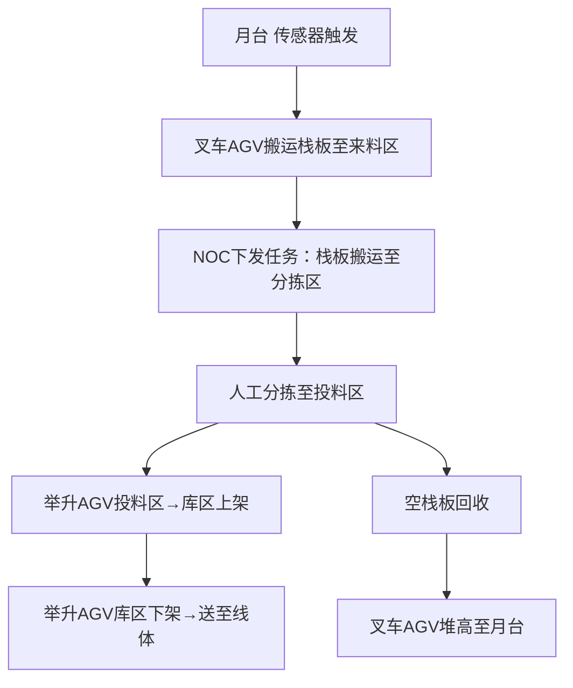

# AGV物流方案设计评估邮件

**主题：华检华飞差异化备料项目（A3-1露台→A3-1线体）AGV初步方案评估**

---

## **1. 现状分析与项目背景**
- **当前痛点**：
- 大件物料依赖人工搬运，效率低且占用空间大。
- 空栈板堆积占用场地，缺乏自动化回收机制。
- **项目目标**：
- 通过AGV实现月台→分拣区→线体的自动化备料流程。
- 大件物料保留人工搬运，其余环节自动化覆盖。

---

## **2. 业务流程图**


---

## **3. 物流量计算与设备需求**
### 关键数据：
| **任务类型**| **AGV需求（台）** | **单台搬运能力（趟/小时）** |
|----------------------------|-------------------|---------------------------|
| 传感器触发任务（叉车AGV）| 0.5| 8.16|
| 分拣栈板上料（叉车AGV）| 0.3| 13.23|
| 分拣上架（举升AGV）| 0.4| 26.58|
| 出库/回库任务（举升AGV）| 1.1| 8.92|

### **设备需求总结**：
- **叉车AGV**：日均任务量 **40趟/10h** → 需 **1.3台** → **新增2台**（支持空栈板堆高）。
- **举升AGV**：日均任务量 **100趟/10h** → 需 **2.6台** → **新增3台**（600kg 4代车，可利旧包材仓设备）。
- **充电桩**：新增叉车充电桩×1，举升AGV充电桩×1（可选）。
- **网络设备**：新增备用AP×2。

---

## **4. 方案优化点**
### **路线规划**：
- 无需电梯，路线基于CAD图纸设计（附件已附），预留扩容空间。
- 货架间距：举升区 **1350×1150mm**（兼容1260×1030mm货架）。
### **关键创新**：
- **空栈板自动化堆高**：叉车AGV回收空栈板至月台堆高，节省30%仓储空间。
- **NOC系统集成**：全流程任务自动化调度（传感器触发+人工指令）。

---

## **5. 可行性评估**
| **指标**| **评估结果**|
|----------------|----------------------------|
| **技术可行**| ✔️ 叉车/举升AGV成熟方案，无梯控限制。 |
| **效率提升**| ✔️ 人工环节减少50%，任务响应速度提升30%。 |
| **成本效益**| ✔️ 设备回收周期≤2年（省人工+省空间）。 |
| **扩容能力**| ✔️ 路线预留扩展接口，支持未来新增货架区。 |

---

## **6. 新增设备清单**
| **设备类型**| **规格**| **数量** | **备注**|
|----------------------|------------------------|----------|-------------------------|
| 叉车AGV| 支持空栈板堆高| 2台| 新增|
| 举升AGV| 600kg（4代车）| 3台| 可利旧包材仓设备|
| 叉车充电桩| 标准型号| 1台| 新增|
| 无线AP| 工业级| 2台| 备用网络覆盖|

---

## **7. 附件说明**
1. **[A3-1华检华飞差异化备料项目CAD路线图纸]**：1F/2F/3F详细路径规划。
2. **[物流量计算表]**：完整任务时间与效率分析。
3. **[设备采购清单]**：型号与报价明细。

---
**后续行动**：
请审核方案细节，确认设备选型与路线规划。若需调整或补充数据，请于3个工作日内反馈。

**技术支持**
AGV物流方案设计组
2023年10月25日

---

```html
<!DOCTYPE html>
<html>
<head>
<meta charset="UTF-8">
<title>华检华飞差异化备料项目AGV方案</title>
<style>
body { font-family: Arial, sans-serif; line-height: 1.6; }
h1 { color: #2F5496; border-bottom: 2px solid #2F5496; }
h2 { color: #2F5496; }
table { border-collapse: collapse; width: 100%; margin: 20px 0; }
th, td { border: 1px solid #ddd; padding: 8px; text-align: left; }
th { background-color: #f2f2f2; }
.highlight { background-color: #FFF2CC; }
</style>
</head>
<body>
<h1>华检华飞差异化备料项目（A3-1露台→A3-1线体）AGV方案评估</h1>

<h2>1. 现状分析与项目背景</h2>
<ul>
<li><strong>当前痛点</strong>：大件物料依赖人工搬运；空栈板堆积占用空间。</li>
<li><strong>项目目标</strong>：月台→分拣区→线体全流程自动化（大件除外）。</li>
</ul>

<h2>2. 业务流程图</h2>
<p>月台 → 叉车AGV搬运 → 分拣区 → 人工分拣 → 举升AGV上架 → 出库至线体</p>
<p>空栈板 → 叉车AGV堆高回收</p>

<h2>3. 物流量计算与设备需求</h2>
<table>
<tr>
<th>任务类型</th>
<th>AGV需求（台）</th>
<th>单台搬运能力（趟/小时）</th>
</tr>
<tr>
<td>传感器触发任务（叉车AGV）</td>
<td>0.5</td>
<td>8.16</td>
</tr>
<tr>
<td>分拣栈板上料（叉车AGV）</td>
<td>0.3</td>
<td>13.23</td>
</tr>
<tr class="highlight">
<td><strong>叉车AGV总计</strong></td>
<td><strong>1.3 → 新增2台</strong></td>
<td>-</td>
</tr>
<tr>
<td>分拣上架（举升AGV）</td>
<td>0.4</td>
<td>26.58</td>
</tr>
<tr>
<td>出库任务（举升AGV）</td>
<td>1.1</td>
<td>8.92</td>
</tr>
<tr class="highlight">
<td><strong>举升AGV总计</strong></td>
<td><strong>2.6 → 新增3台</strong></td>
<td>-</td>
</tr>
</table>

<h2>4. 关键优化点</h2>
<ul>
<li>空栈板自动化堆高：节省30%仓储空间。</li>
<li>路线设计：无电梯依赖，CAD图纸预留扩容接口。</li>
</ul>

<h2>5. 新增设备清单</h2>
<table>
<tr>
<th>设备类型</th>
<th>数量</th>
<th>备注</th>
</tr>
<tr>
<td>叉车AGV（带堆高功能）</td>
<td>2台</td>
<td>新增</td>
</tr>
<tr>
<td>举升AGV（600kg 4代车）</td>
<td>3台</td>
<td>可利旧包材仓设备</td>
</tr>
<tr>
<td>叉车充电桩</td>
<td>1台</td>
<td>新增</td>
</tr>
<tr>
<td>工业AP</td>
<td>2台</td>
<td>备用网络覆盖</td>
</tr>
</table>

<h2>6. 附件</h2>
<ul>
<li>A3-1华检华飞差异化备料项目CAD路线图纸</li>
<li>物流量计算表</li>
<li>设备采购清单</li>
</ul>

<p><strong>后续行动：</strong>请审核方案细节并于3个工作日内反馈意见。</p>
</body>
</html>
```

### 邮件使用说明：
1. 以上HTML代码可直接粘贴到Outlook 2016的新建邮件中，选择"插入" → "HTML" 格式。
2. 关键数据以表格呈现，重点内容高亮标记（黄色背景）。
3. 流程图以Mermaid语法描述（粘贴至邮件时需转换为图片）。
4. 附件需手动添加至邮件附件栏位。