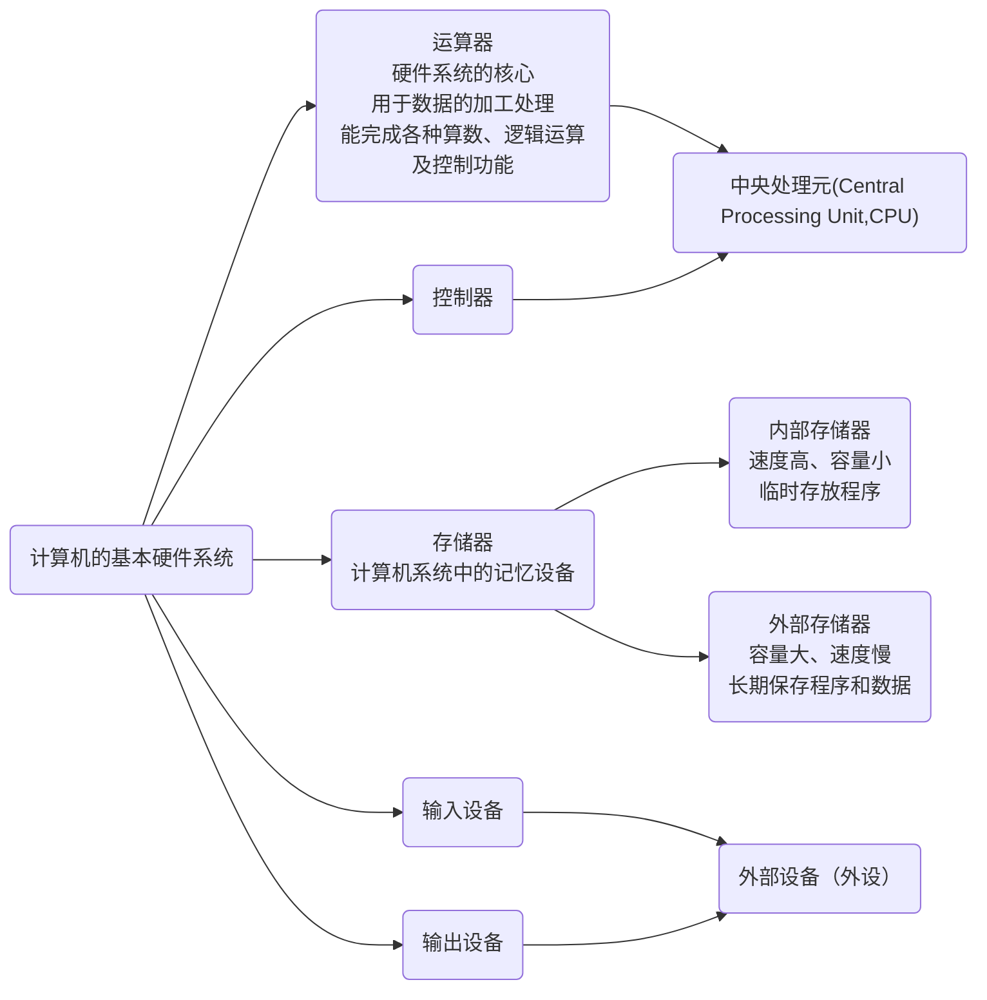
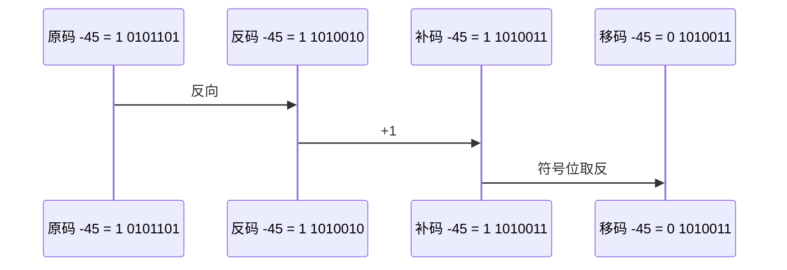

# 软件设计师教程

## 第一章 计算机系统知识

### 1.1 计算机系统基础知识

#### 1.1.1 计算机系统硬件基本组成



#### 1.1.2 中央处理单元

1. CPU 的功能

   1. 程序控制
      1. CPU 通过执行指令来控制程序的执行顺序
      2. 这是 CPU 的重要职能
   2. 操作控制
      1. 一条指令功能的实现需要若干操作信号来完成
      2. CPU 产生每条指令的操作信号并将操作信号送往不同的部件
      3. 控制响应的部件按指令的功能要求进行操作
   3. 时间控制
      1. CPU 对各种操作进行时间上的控制
      2. CPU 对每条指令的整个执行时间要进行严格控制
      3. 同时，指令执行过程中操作信号的出现时间、持续时间及出现的时间顺序都需要进行严格控制
   4. 数据处理
      1. CPU 通过对数据进行算数运算及逻辑运算等方式进行加工处理
      2. 数据加工处理的结果被人们所利用
      3. 对数据的加工处理是CPU最根本的任务

2. CPU 的组成

   

   1. 运算器

      1. 主要功能

         1. 执行所有的算数运算
            1. 加、减、乘、除等基本运算及附加运算
         2. 执行所有的逻辑运算并进行逻辑测试
            1. 与、或、非、零值测试或两个值的比较等。

      2. 组成部件和功能

         1. 算数逻辑单元（Arithmetic and Logic Unit,ALU）

            1. ALU是运算器的重要组成部件
            2. 负责处理数据
            3. 实现对数据的算术运算和逻辑运算

         2. 累加寄存器（AC）

            1. 通常简称累加器，是一个通用寄存器

            2. 其功能是当运算器的算术逻辑单元执行算术或逻辑运算时，为ALU提供一个工作区

               例子

               ```mermaid
               sequenceDiagram
                   participant 累加寄存器（AC）
                   participant 内存储存器
                   participant 算数逻辑单元（ALU）
                   participant 被减数
                   被减数->>累加寄存器（AC）: 暂取到
                   内存储存器 ->> 整数 :取出整数
               	整数 ->> 累加寄存器（AC） :与AC的内容相减，所得结果运回AC
               ```

         3. 数据缓冲寄存器（DR）
   
            1. 在对内存储器进行读写操作时，用DR暂时存放由内存储器读写的一条指令或一个数据字，将不同时间段内读写的数据隔离开来。
         2. 主要作用：
               1. 作为 CPU 和内存、外部设备之间数据传送的中转站
            2. 作为 CPU 和内存、外围设备之间在操作速度上的缓冲
               3. 在单累加器结构的运算器中，数据缓冲寄存器还可兼作为操作数寄存器
         
         4. 状态条件寄存器（PSW）
         
            1. PSW 保存由算数指令和逻辑指令运行或测试的结果建立的各种条件码内容
            2. 状态标志
               1. 运算结果进位标志（C）
               2. 运算结果溢出标志（V）
               3. 运算结果为 0 标志（Z）
               4. 运算结果为负标志（N）
            3. 控制标志
               1. 中断标志（I）
               2. 方向标志（D）
               3. 单步标志
               4. ...
            4. 通常，一个算数操作产生一个运算结果，而一个逻辑操作则产生一个判决。
   
   2. 控制器
   
      1. 主要功能
   
         1. 控制器用于控制整个CPU的工作，它决定了计算机运行过程的自动化
         2. 不仅要保证程序的正确执行，而且要能够处理异常事件
   
      2. 组成部分及功能
   
         1. 指令寄存器（IR）
   
            ```mermaid
            sequenceDiagram
                内存储器->>缓冲寄存器: 1.当CPU执行一条指令时
                缓冲寄存器 ->> 指令寄存器（IR） :2.暂存
            	指令译码器 ->> 指令寄存器（IR） :3.根据IR的内容产生各种微操作指令
            ```
            
            
            
         2. 程序计数器（PC）
   
            1. PC具有寄存信息和计数两种功能，又称为指令计数器。
      2. 程序的执行分两种情况，一是顺序执行，二是转移执行。
            3. 在程序开始执行前，将程序的起始地址送入PC，该地址在程序加载到内存时确定，因此PC的内容即是程序第一条指令的地址。执行指令时，CPU将自动修改PC的内容，以便使其保持的总是将要执行的下一条指令的地址。由于大多数指令都是按顺序来执行的，所以修改的过程通常只是简单地对PC加1。当遇到转移指令时，后继指令的地址根据当前指令的地址加上一个向前或向后转移的位移量得到，或者根据转移指令给出的直接转移的地址得到。
   
         3. 地址寄存器（AR）
   
         4. 指令译码器（ID）
   
   3. 寄存器组
   
      1. 专用寄存器
         1. 运算器和控制器中的寄存器是专用寄存器
         2. 其作用是固定的。
      2. 通用寄存器
         1. 通用寄存器用途广泛并可由程序员规定其用途
         2. 其数目因处理器不同有所差异
   
3. 多核CPU

1)原码、反码、补码和移码



## 第二章 程序语言基础知识

## 第三章 操作系统知识

## 第四章 系统开发和运行知识

## 第五章 网络基础知识

## 第六章 多媒体基础知识

## 第七章 数据库基础知识

## 第八章 数据结构

## 第九章 算法设计与分析

## 第十章 面向对象技术

## 第十一章 标准化和软件知识产权基础知识

## 第十二章 软件系统分析与设计


```

```