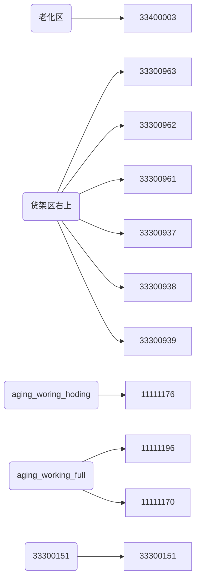

# 老化区任务

## 1. 梳理


老化区


左上上料点 11111176 11111196


老化区库位状态

0 空库位 无货架

1 半满库位  AGV到点后变更（AGV不可搬运）

2 满库位  （AGV可搬运）

3 老化完成  上层变更，可以接任务

4 老化中  未定（同1，可直接使用1）

5 手动模式   上层变更（同1，可直接使用1）

6 空货架 上层变更后自动下发任务


流程

1. 老化区有空货架，自动下发去左上角缓存区任务
2. 左上角缓存区为满，左上角工作台为空的情况下，自动下发缓存区搬运至工作台任务，并变更库位状态为半满
3. 上货完成后上层系统变更工作台库位状态为 2 满库位
4. 工作台满库位，自动下发搬运至老化区任务，并变更为 1 半满库位
5. 上层系统变更老化完成货架为 3 老化完成
6. 自动搬运老化完成货架至右下角工作台，并变更为 1 半满库位 
7. 下架完成后，上层系统变更该点位为空库位
8. 自动下发空库位至老化区，并变更为 6 空货架
9. 回到流程 1

## 2. 片区域

- 左上角
  - aging_working_hoding
    - 11111176
  - aging_woring
    - 11111196
- 老化区
  - 老化区（33400003）
- 右下角
  - aging_working_full
    - 11111170

## 3. 细节

1. 老化区有空货架 6 ，自动下发去左上角缓存区任务
   1. auto_to_aging_working_hoding
      1. 老化自动送左上工作台等待点
      2. 老化区 -> 11111176
   2. 由等待点11111176触发，不下发点位
2. 左上角缓存区为满，左上角工作台为空的情况下，自动下发缓存区搬运至工作台任务，并变更库位状态为半满
   1. auto_to_aging_working
      1. 老化自动送左上工作台
      2. 11111176 -> 11111196
3. 上货完成后上层系统变更工作台 11111196 库位状态为 2 满库位
   1. 
4. 工作台满库位，自动下发搬运至老化区（点1 33400024）任务，并变更为 1 半满库位
   1. auto_to_aging_full
      1. 自动去老化区满货架
5. 上层系统变更老化完成货架为 3 老化完成
6. 自动搬运老化完成货架至右下角工作台，并变更为 1 半满库位 
   1. auto_to_aging_working_full
   2. 老化自动送满右下工作台    11111170
7. 下架完成后，上层系统变更该点位 11111170 为 6 空货架
8. 自动下发空库位至老化区，并变更为 6 空货架
   1. auto_to_aging_empty
      1. 自动去老化区空货架
9. 回到流程 1

## 4. 状态上报

任务结束时上报，货架号及点位

| tenLineUpload | 十线线体上报 | 任务状态上报 | http://10.68.125.12:9099/setTaskStatus |


## 5. post 接口详细

### 查询库位状态接口

```
http://10.68.2.14:7000/ics/out/getStockStatus
```

#### post 请求报文

```
{
  "areaId": "7",           //所在区域的id
  "pageSize": "20",        //查询数量
  "pageNo": "1",           //查询页数
  "areaName": "货架区右上"  //查询的片区域名称（具体见平台片区域配置）
}
```

#### 返回

```
{
    "code": 1000,
    "data": {
        "stockList": [
            {
                "areaId": "7",
                "inTask": "0",
                "qrContent": "33300937",
                "stockStatus": 6
            },
            {
                "areaId": "7",
                "inTask": "0",
                "qrContent": "33300938",
                "stockStatus": 6
            },
            {
                "areaId": "7",
                "inTask": "0",
                "qrContent": "33300939",
                "stockStatus": 0
            },
            {
                "areaId": "7",
                "inTask": "0",
                "qrContent": "33300961",
                "stockStatus": 2
            },
            {
                "areaId": "7",
                "inTask": "0",
                "qrContent": "33300962",
                "stockStatus": 0
            },
            {
                "areaId": "7",
                "inTask": "0",
                "qrContent": "33300963",
                "stockStatus": 6
            }
        ],
        "totalNum": 6,
        "totalPage": 1,
        "pageNo": 1,
        "pageSize": 20
    },
    "desc": "请求成功"
}
```

#### 库位状态


|stock_status_typr | stock_status_name|
| ---- | ---- |
|0|空库位|
|1|半满库位|
|2|满库位|
|-1|不限库位状态|
|3|老化完成|
|4|老化中|
|5|手动模式|
|6|空货架|


#### 片区域



### 变更库位状态接口
```
http://10.68.2.14:7000/ics/stock/update/appStockStatus
```

#### post 请求报文

```
{
"qrContent":"33300939",    //要改变的点位
"nodeStatus":"0"           //要变成的状态
}
```
#### 返回

```
{
    "code": 1000,
    "data": "请求成功",
    "desc": "请求成功"
}
```