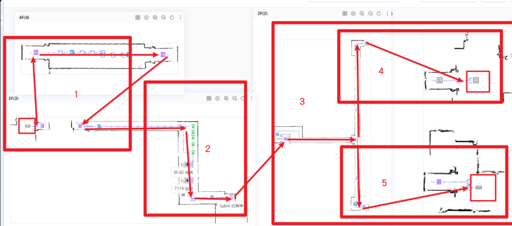
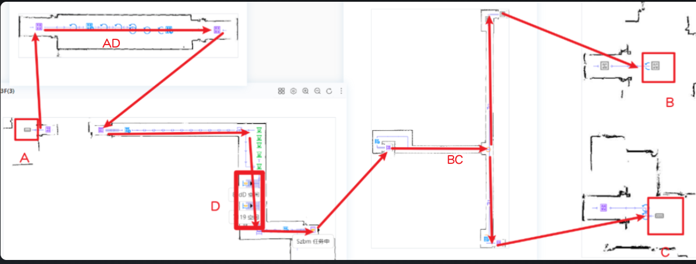

# 流程梳理

## 任务流

1. D -> A -> B -> D
2. D -> A -> C -> D
3. D -> B -> A -> D
4. D -> C -> A -> D

## 条件局限

1. 电梯条件
   1. 安全问题，前期电梯与 plc 联调完成后，电梯无法确保空车任务能够安全完成
   2. 路线问题，电梯长度长，路线长，导致一天的测试量少，测试时间较长
2. 软件条件
   1. 不支持直接跨越多个电梯 A -> B 的任务（若要支持，至少需要单设备或者双通道）
      1. 现场有三辆车，需要考虑多车交互问题。
      2. 现场路线过窄，没有避让点，如果两台设备进入二楼会导致堵死。
         1. 询问算法后，设备如果离电梯入口点比较近，会导致不会避让。实际测试，大概已经规划出进电梯的路线就不会避让。
      3. 电梯不支持一次跨越两个电梯，如 D -> A ,会报路径不可达，可以从 D -> B 但是不同区域不会有锁格保留。
      4. 单通道，导致电梯入口和出口为同一点位，同问题 2 ，平台不支持电梯对向死锁问题，堵死在电梯口。如 3F 设备要去 2F，只会看入口有没有车，此时有设备从 2F 到 3F 就会出现死锁，同时算法不会解死锁。
   2. 容量管控问题
      1. 业务流程模板下配置多个任务模板的情况下，tps 容量管控不生效（即工作台容量），之后改为锁定片区域。
      2. 业务流程模板下配置多个任务模板的情况下，子任务的任务设备管控不生效，测试发现为仅下发的第一个子任务生效，完成后就释放容量。
         1. 
      3. 两个区域的点不能出现在同一个片区域里，无法使用片区域的设备管控。
   3. 没有上层系统管控，完全使用平台进行管控，任务通过 pad 下发。

# 任务模板配置

最开始时是使用一条任务，共 8 条子任务，测试跑通空车，经测试后发现，没有锁格。

现场说想三辆车都用起来，所以先确定的方案为分为 5 个区域，1 区域使用锁定片区域的方法可以完成，即在 2 区域进 1 区域的电梯前设定一个点位，去 1 区域都要经过这个点，从而锁住，不会有其他任务进 1 区域。

3 区域因为有两个子区域，所以更复杂

1. 前往 4 区域只能有一个任务
2. 前往 5 区域只能有一个任务
3. 从 3 区域返回 2 区域时要锁住 3 区域

锁片区域的办法对第三个条件完成不了，只能退而求其次，改成 1,2,3 共三个区域

最后的解决方案是，3 区域只能去一个车， 1 区域只能去一个车，用的锁 2 区域电梯入口的办法，只要有车进去电梯就锁定电梯入口，直到设备回来才解锁。

任务模板流程

- 2 -> 1 -> 2
  - D -> AD -> A -> AD -> D
- 2 -> 3 -> 2
  - D -> BC -> B -> BC -> D
  - D -> BC -> C -> BC -> D

## 呼叫器配置任务模板

1. D -> A -> B -> D
   1. D -> AD -> A -> AD -> D
   2. D -> BC -> B -> BC -> D
2. D -> A -> C -> D
   1. D -> AD -> A -> AD -> D
   2. D -> BC -> C -> BC -> D
3. D -> B -> A -> D
   1. D -> BC -> B -> BC -> D
   2. D -> AD -> A -> AD -> D
4. D -> C -> A -> D
   1. D -> BC -> C -> BC -> D
   2. D -> AD -> A -> AD -> D

