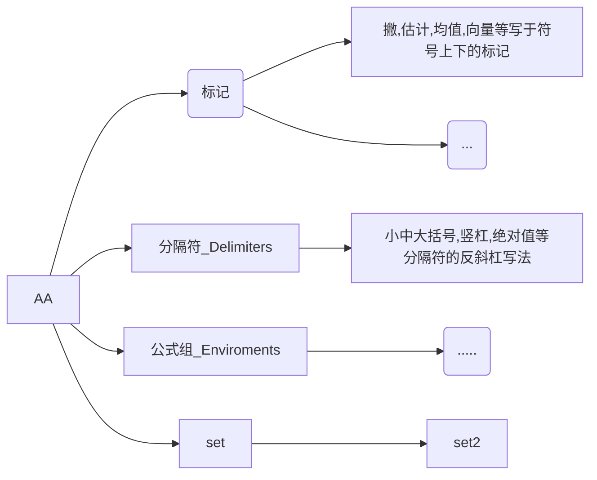

A1
    A2
    A3
B1
    B2

```mermaid
graph LR
AA--> A(标记)
A-->撇,估计,均值,向量等写于符号上下的标记
AA--> 分隔符_Delimiters
分隔符_Delimiters-->小中大括号,竖杠,绝对值等分隔符的反斜杠写法
AA--> 公式组_Enviroments
公式组_Enviroments-->B(.....)
A-->C(...)
AA-->set
set --> set2
```