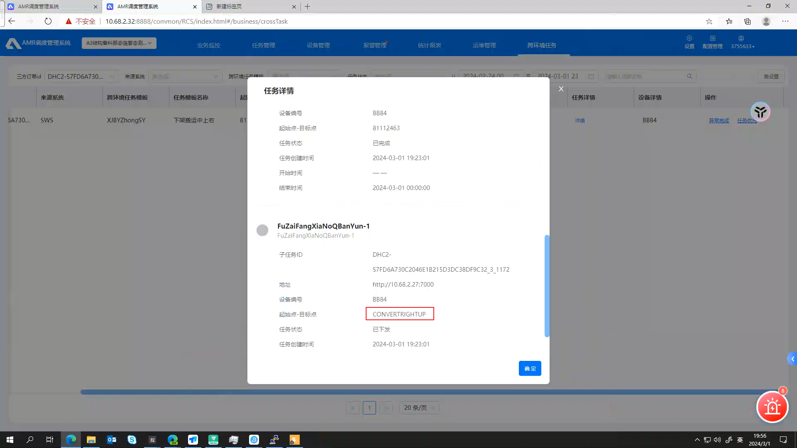
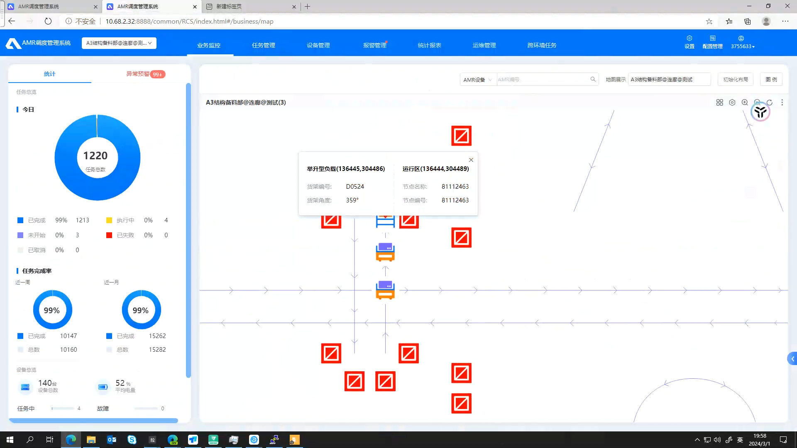
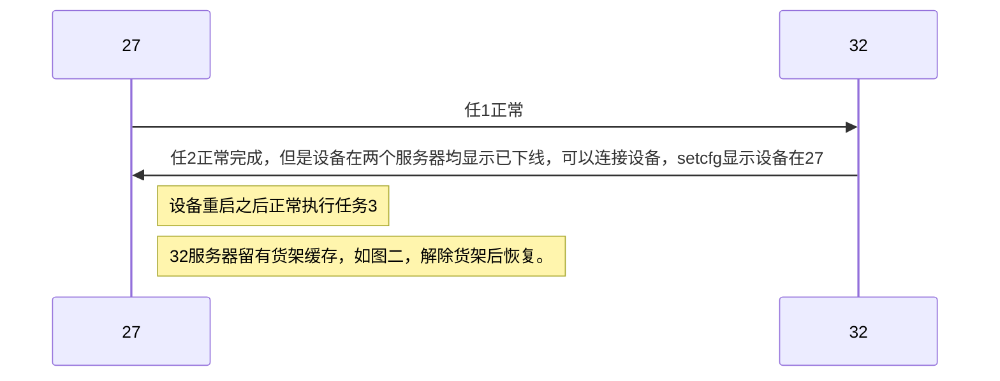

# 设备在交接点，但是两个服务器都没有上线

输入的任务ID为:DHC2-57FD6A730C2046E1B215D3DC38DF9C32_3_1172
数据库连接成功:10.68.2.27

所在区域id为：1
任务模板为：FuZaiFangXiaNoQBanYun-1
分派的AGV为:BB84
设备序列号为：CA07160BAK00003
路径点集为:81112487
分派的AGV设备类型为:DH-RTA-C060-Q,DH-RTA-C060-Q-2L-200,DH-RTA-C060-Q-L-300,DH-RTA-C060-QB,OEM-RTA-C060-Q-L-200,RTA-C060-LQ-L-200,RTA-C060-Q-LDHG,RTA-C100-Q-L-200
下发的货架模型编号为:103
下发的货架模型为:行业备料部长方形货架
任务货架为：D0524
错误描述:
任务创建时间:2024-03-01 19:20:47
任务开始时间:2024-03-01 19:49:52
任务结束时间:1970-01-01 08:00:00
任务状态值为:6
任务状态为:运行中
order_id:985158
out_order_id:988055
